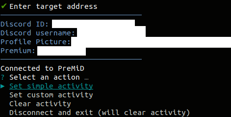

# Premess
A tool that helps you to mess PreMiD users up



# Installation
You need [NodeJS](https://nodejs.org/) in order to run premess. You may download it directly from the official webpage or install using package manager.

## Debian / Ubuntu
```
sudo apt update
sudo apt install nodejs git
```

## Termux
```
pkg update
pkg install nodejs git
```

After that, clone this repository and install dependencies

```
git clone https://github.com/Noxturnix/premess
cd premess
npm i
```

To run premess, just use the following command
```
npm start
```

# Custom Activity
Create "custom-activity.json" or copy the example file and configure custom activity

```JSON
{
    "clientId": "463097721130188830",
    "presenceData": {
        "details": "Darude - Sandstorm",
        "state": "Darude",
        "largeImageKey": "yt_lg",
        "smallImageKey": "play",
        "smallImageText": "Playing",
        "largeImageText": "Premess"
    },
    "trayTitle": "Darude - Sandstorm",
    "playback": true
}
```